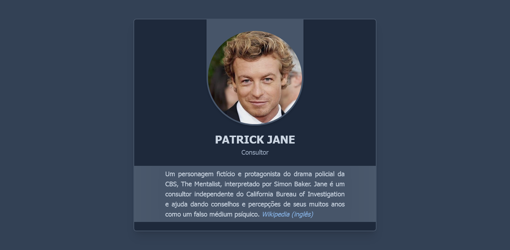

<h1 align="center">Presentation Card - Tailwind CSS</h1>

    
    
<a href="https://refusado.github.io/tailwind-presentation-card/">Deploy</a>

Cartão de apresentação minimalista e elegante com cores em diferentes tons de <i><a href="https://en.wikipedia.org/wiki/Slate_gray">slate gray</a></i>, um cinza com leve tom de azul que se refere à rocha ardósia.

Este projeto foi criado objetivando um estudo de configurações e testes com o framework <a href="https://tailwindcss.com/">Tailwind CSS</a>. Com esse repositório consigo me familiarizar com o uso, a produção e a estilização personalizada de projetos com o framework antes da utilização em um projeto real.
